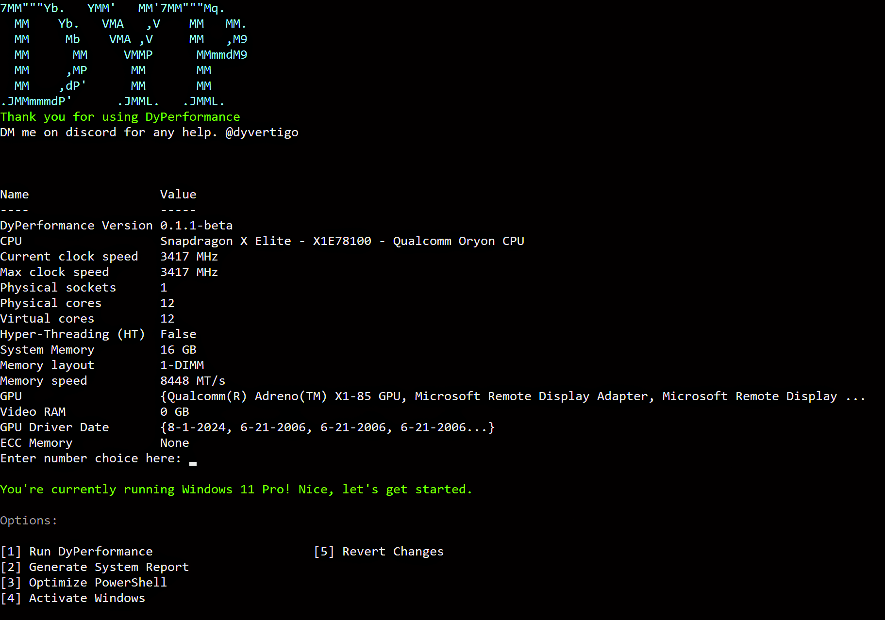

   <a name="top"></a>
   # <p align="center"> ✨ DyPerformance - Maximize Your Windows 11 Experience </p>
   
   <div align="center">
   
   
   
   
   </div>
   <h4 align="center"> "DyPerformance" enhances Windows 11 for productivity, gaming, development, media, and more. </h4>
   
   ## ⚙️ Installation-Guide
   
   > **Important:** This script is specifically designed for Windows 11. Running it on Windows 10 may lead to unexpected results.
   
   ### Steps to Install
   1. Launch PowerShell with admin rights.
   2. Run the following command:
   
      ```powershell
      iwr -useb https://github.com/dyvertigo/DyPerformance/releases/download/0.1.1-beta/DyPerformance.ps1 | iex
   
   3. Follow the prompts to apply your selected optimizations.
   4. Reboot to apply changes fully.

   ## 🌄 Preview
   
   

   ## ❔ FAQ
   
   ### 🛡️ Is DyPerformance safe to use?
   
   Yes, DyPerformance is designed with safety in mind. It makes non-invasive system tweaks and doesn’t install any third-party software. You can review the [source code](DyPerformance.ps1) to understand the changes made.
   
   ### 🔄 What if something goes wrong?
   
   A system restore point is automatically created before applying any changes. This allows you to revert back if needed. By running the script, you agree to this safeguard.
   
   ### 🖥️ Can this script work on older PCs?
   
   Yes, the script has been tested on hardware as old as 2010 with positive results. However, older configurations may show variable outcomes depending on their specifications.
   
   ### 📞 Where can I get help if I have issues?
   
   For community support, reach out to me on Discord @dyvertigo. Alternatively, you can open an issue on GitHub for assistance.
   
   ---
   
   <div align="center">
   
   This project is inspired by and based on *Refyne*, which is also licensed under the MIT License. 
   
   [Back to Top](#top)
   
   </div>
